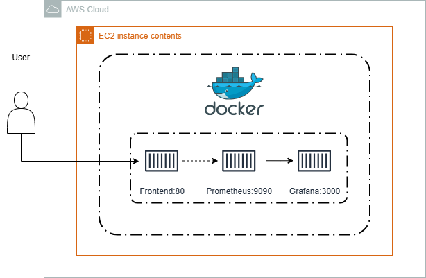

# Apresentação: Arquitetura de Software e Evolução para a FastByte

## Introdução
Esta apresentação explora os conceitos de **SOA (Service-Oriented Architecture)** e **Microserviços**, culminando na análise da nossa arquitetura atual na **FastByte**.

## SOA (Service-Oriented Architecture)
* **Conceito:** Arquitetura baseada em serviços que se comunicam através de protocolos de rede.
* **Foco:** Reutilização de serviços e integração de sistemas legados.
* **Comunicação:** Geralmente centralizada por um ESB (Enterprise Service Bus).

## Microserviços
* **Conceito:** Evolução do SOA. Aplicação composta por pequenos serviços independentes.
* **Foco:** Agilidade, escalabilidade e implantação independente.
* **Comunicação:** Geralmente descentralizada (APIs REST, mensageria).

## Nossa Arquitetura Atual
A arquitetura da **FastByte** adota uma abordagem moderna utilizando **Docker** para isolamento e **monitoramento proativo**.

### Justificativa Técnica: O Perigo da Abordagem Legada
Para um ambiente dinâmico como a **FastByte** em noites de sexta-feira — onde o tráfego é imprevisível e o tempo de resposta é crítico —, adotar uma arquitetura SOA monolítica com um **ESB (Enterprise Service Bus) centralizado** e **banco de dados compartilhado** seria um erro estratégico. O ESB atua como um "ponto único de falha": em momentos de alta carga, ele se torna um gargalo que bloqueia as requisições. Paralelamente, o banco de dados compartilhado cria um acoplamento onde uma consulta lenta num componente pode derrubar toda a plataforma devido a *locks*. Essa rigidez inviabiliza a agilidade necessária para o nosso crescimento.

### Por que nossa arquitetura é sólida:
1. **Isolamento via Docker:** Garantimos consistência entre ambientes de desenvolvimento e produção.
2. **Monitoramento Integrado:**
    * **Prometheus:** Coleta métricas de saúde do nosso frontend em tempo real.
    * **Grafana:** Visualização poderosa que nos dá visibilidade imediata de falhas.
3. **Escalabilidade:** Estamos preparados para extrair esses containers para instâncias separadas (microserviços) assim que a demanda aumentar, sem alterar a lógica de monitoramento.

## Conclusão
Embora iniciemos com uma arquitetura centralizada (eficiente e econômica), nossa estrutura de containers e monitoramento é **nativamente preparada para a transição para microserviços**, garantindo que a **FastByte** cresça com sustentabilidade e observabilidade.