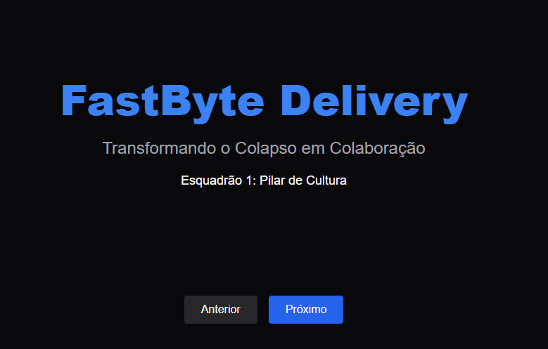

# Esquadrão 1: Transformação Cultural — FastByte Delivery

github : https://github.com/paulocarlosfilho/aponti-fastbyte

Este documento detalha a estratégia de transformação cultural proposta para a FastByte Delivery, focada em resolver o colapso operacional através da mudança de comportamento e colaboração entre equipes.

## 🎯 Objetivo
Quebrar a barreira entre as equipes de Desenvolvimento (Dev) e Operações (Ops), transformando um ambiente de isolamento e acusações em uma cultura de responsabilidade compartilhada e evolução contínua.

---

## 🛑 O Anti-Padrão: O Muro da Confusão
Atualmente, a FastByte opera sob um modelo insustentável:
* **Silos:** O código é "jogado por cima do muro" na sexta-feira à noite, sem que o time de Ops saiba o que foi alterado.
* **Acusações:** O ambiente é marcado pelo comportamento onde, ao menor sinal de falha, o time de Dev diz "na minha máquina funciona" e o time de Ops responde com "o código de vocês derrubou o servidor".
* **Impacto no Negócio:** O custo desse modelo é o esgotamento total dos profissionais de operações, que perdem seus fins de semana consertando o app, além de uma instabilidade constante que afasta os clientes.

---

## 💡 Pilar de Cultura: Mudança de Paradigma
A transformação baseia-se em três pilares fundamentais para a cultura DevOps:

1. **Responsabilidade Compartilhada:** O sucesso do aplicativo é de toda a FastByte, não apenas de um departamento. A meta de disponibilidade deve ser de todos.
2. **Mentalidade "Blameless" (Culpa Zero):** Substituímos a busca por culpados ("quem foi o estagiário que derrubou o banco?") pela análise de falhas no processo ("por que nosso script de deploy permitiu essa falha?").
3. **Colaboração Integrada:** A integração entre Dev e Ops ocorre desde o planejamento inicial, evitando surpresas na entrega e alinhando expectativas de infraestrutura desde o primeiro dia.

---

## 🚀 Estudos de Caso: Como os gigantes fazem

* **Netflix (Responsabilidade Compartilhada):** A Netflix aplica o princípio *"You build it, you run it"*. O desenvolvedor é o responsável pelo seu código mesmo em produção. Exemplo: se uma nova funcionalidade de recomendação causa lentidão, é o desenvolvedor que criou essa funcionalidade quem atua na resolução junto com a equipe de Ops, garantindo que o código seja construído com foco em resiliência desde o início.
* **Amazon (Mentalidade "Blameless"):** Após qualquer incidente crítico, a Amazon realiza uma reunião de *Post-mortem* focada exclusivamente no processo técnico. Exemplo: ao invés de punir quem esqueceu uma configuração, o time altera o código da ferramenta de deploy para que ela avise automaticamente se aquela configuração estiver ausente, tornando o erro humano impossível de ser repetido.

---

## 🚀 Resultados Esperados
* **Sustentabilidade:** Fim dos fins de semana perdidos e redução do estresse crônico das equipes.
* **Estabilidade:** Um ambiente previsível onde o crescimento do app não resulta em quedas inesperadas por sobrecarga.
* **Ambiente de Confiança:** Criação de um espaço onde o erro é visto como um ativo de aprendizado, e não como uma sentença de punição.

> *"A tecnologia é apenas o meio. A cultura é o que sustenta a escalabilidade da FastByte Delivery."*
# Esquadrão 1: Transformação Cultural — FastByte Delivery

Este documento detalha a estratégia de transformação cultural proposta para a FastByte Delivery, focada em resolver o colapso operacional através da mudança de comportamento e colaboração entre equipes.

## 🎯 Objetivo
Quebrar a barreira entre as equipes de Desenvolvimento (Dev) e Operações (Ops), transformando um ambiente de isolamento e acusações em uma cultura de responsabilidade compartilhada e evolução contínua.

---

## 🛑 O Anti-Padrão: O Muro da Confusão
Atualmente, a FastByte opera sob um modelo insustentável:
* **Silos:** O código é "jogado por cima do muro" na sexta-feira à noite, sem que o time de Ops saiba o que foi alterado.
* **Acusações:** O ambiente é marcado pelo comportamento onde, ao menor sinal de falha, o time de Dev diz "na minha máquina funciona" e o time de Ops responde com "o código de vocês derrubou o servidor".
* **Impacto no Negócio:** O custo desse modelo é o esgotamento total dos profissionais de operações, que perdem seus fins de semana consertando o app, além de uma instabilidade constante que afasta os clientes.

---

## 💡 Pilar de Cultura: Mudança de Paradigma
A transformação baseia-se em três pilares fundamentais para a cultura DevOps:

1. **Responsabilidade Compartilhada:** O sucesso do aplicativo é de toda a FastByte, não apenas de um departamento. A meta de disponibilidade deve ser de todos.
2. **Mentalidade "Blameless" (Culpa Zero):** Substituímos a busca por culpados ("quem foi o estagiário que derrubou o banco?") pela análise de falhas no processo ("por que nosso script de deploy permitiu essa falha?").
3. **Colaboração Integrada:** A integração entre Dev e Ops ocorre desde o planejamento inicial, evitando surpresas na entrega e alinhando expectativas de infraestrutura desde o primeiro dia.

---

## 🚀 Estudos de Caso: Como os gigantes fazem

* **Netflix (Responsabilidade Compartilhada):** A Netflix aplica o princípio *"You build it, you run it"*. O desenvolvedor é o responsável pelo seu código mesmo em produção. Exemplo: se uma nova funcionalidade de recomendação causa lentidão, é o desenvolvedor que criou essa funcionalidade quem atua na resolução junto com a equipe de Ops, garantindo que o código seja construído com foco em resiliência desde o início.
* **Amazon (Mentalidade "Blameless"):** Após qualquer incidente crítico, a Amazon realiza uma reunião de *Post-mortem* focada exclusivamente no processo técnico. Exemplo: ao invés de punir quem esqueceu uma configuração, o time altera o código da ferramenta de deploy para que ela avise automaticamente se aquela configuração estiver ausente, tornando o erro humano impossível de ser repetido.

---

## 🚀 Resultados Esperados
* **Sustentabilidade:** Fim dos fins de semana perdidos e redução do estresse crônico das equipes.
* **Estabilidade:** Um ambiente previsível onde o crescimento do app não resulta em quedas inesperadas por sobrecarga.
* **Ambiente de Confiança:** Criação de um espaço onde o erro é visto como um ativo de aprendizado, e não como uma sentença de punição.

> *"A tecnologia é apenas o meio. A cultura é o que sustenta a escalabilidade da FastByte Delivery."*
